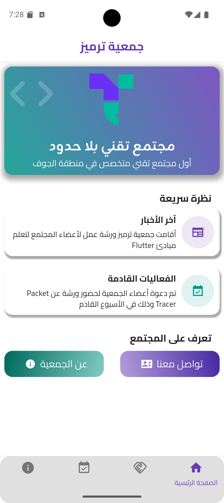
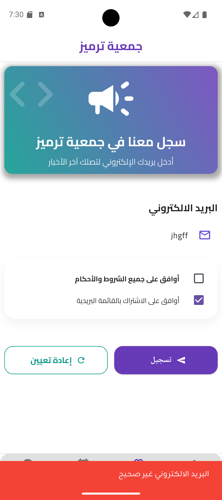
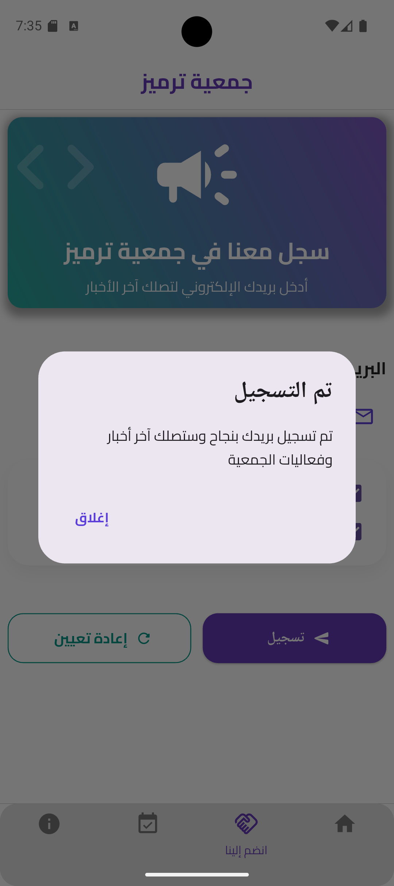

# Tarmiz Community App

تطبيق تعليمي مبني باستخدام Flutter خاص بجمعية ترميز في منطقة الجوف

---

## نبذة عن المشروع

تطبيق يمثل إصدار تجريبي خاص بـ **جمعية ترميز العمومية في منطقة الجوف**، وتم تصميمه ليكون كمثال عملي يمكن استخدامه في الدورات التدريبية أو شروحات تطوير تطبيقات الهواتف الذكية.
مع العلم بأن هذا المشروع لا يمثل النظام الرسمي للجمعية وإنما الهدف منه للأغراض التعليمية فقط.

---

## أهداف التطبيق

تم تطوير هذا التطبيق لتحقيق عدة أهداف تعليمية، من أهمها:

- تقديم مثال عملي لتطوير تطبيق باستخدام **Flutter**
- توضيح كيفية تنظيم مشروع Flutter
- عرض كيفية إنشاء عدة صفحات داخل التطبيق
- شرح آلية التنقل بين الصفحات
- تقديم فكرة تطبيق يخدم مجتمعًا تقنيًا

---

## مميزات التطبيق

- واجهة بسيطة وسهلة الاستخدام
- تصميم حديث باستخدام Flutter
- تنظيم التطبيق إلى عدة صفحات
- شريط تنقل سفلي للتنقل بين الصفحات
- عرض معلومات عن المجتمع
- صفحة للفعاليات
- صفحة لأعضاء الإدارة
- صفحة للانضمام إلى المجتمع

---

## صفحات التطبيق

يتكون التطبيق من عدة صفحات رئيسية:

### الصفحة الرئيسية
نبذة عامة عن الجمعية.

### صفحة الانضمام للمجتمع
إمكانية إضافة البريد الاكتروني للعضو ولكن بدون عملية حفظ فعلية.

### صفحة الفعاليات
تعرض بعض الفعاليات أو الأنشطة التقنية.

### صفحة الأعضاء
صفحة تعريفية بأعضاء إدارة الجمعية.

---

## التقنيات المستخدمة

تم تطوير المشروع باستخدام التقنيات التالية:

- **Flutter**
- **Dart language**

---
## صور من التطبيق

| Home Page | Join Us |
|:---:|:---:|
| 

 | 

 |
| Email Filtering SnackBar | Registration Confirmation AlertDialog |
| 

 | 

 |

